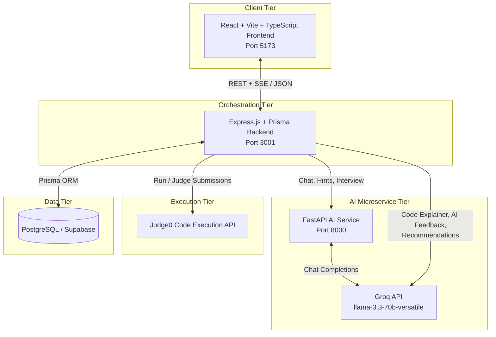

DashBoard:


# 🧠 AlgoAI — AI-Powered DSA Learning Platform

AlgoAI is a full-stack, AI-driven platform for practicing and mastering **Data Structures & Algorithms (DSA)**. It combines an online code judge, personalized progress analytics, and multiple Groq-powered AI tutors (chat, hints, code review, mock interviews) to give learners a guided, adaptive practice loop instead of a static problem list.

The system is built as three cooperating services — a **React/TypeScript frontend**, a **Node.js/Express/Prisma backend**, and a **Python/FastAPI AI microservice** — backed by a **PostgreSQL (Supabase)** database.

---

## ✨ Key Features

### 🧩 Practice & Code Execution
- Browse a curated DSA problem catalogue (`backend/src/data/problems.json`) by topic and difficulty
- In-browser code editor (Monaco) with a **Judge0**-backed execution engine supporting JavaScript, TypeScript, Python, Java, C, and C++
- Step-by-step **code visualizer** that instruments and traces code execution
- Line-by-line **AI code explainer**

### 🤖 AI Tutoring (Groq-powered)
- **AlgoAI Tutor chat** — general Q&A and problem-scoped chat, with both standard and streaming (SSE) responses
- **Progressive hints** — three escalating hint levels (conceptual nudge → named approach → pseudocode) that analyze the student's current code
- **AI code review** — approach summary, complexity analysis, bug detection, edge cases, and improvement suggestions
- **AI feedback & personalized study plans**
- **Mock DSA interviews** with a conversational interviewer flow and configurable interviewer personality

### 📈 Progress, Analytics & Personalization
- Onboarding flow that generates a personalized multi-day DSA **roadmap** based on experience level, goals, and preferred topics
- **Weak topic detection** based on accuracy, attempts, and recent performance
- **Mistake pattern analysis** — per-topic performance, weak patterns (low solve rate), time-efficiency issues, and structured data for further AI/ML use
- **Advanced & standard recommendation engines** for personalized next-problem suggestions
- **Spaced-repetition style revision queue** for problems that need review
- Daily/longest **streak tracking**, a **daily challenge**, and a **daily "boss battle"** gamified assignment system
- Weekly activity view and general user analytics/dashboard

### 🔐 Accounts
- Email/password registration and login with hashed passwords (bcrypt)
- JWT-based authentication and route protection, with optional-auth support for guest onboarding

---

## 🏗️ System Architecture

AlgoAI is organized as three independently runnable services that share a single PostgreSQL database (via Supabase).



**Flow summary**
1. The **frontend** talks exclusively to the Express **backend** over REST (and Server-Sent Events for streaming chat).
2. The **backend** persists users, progress, streaks, roadmaps, and submissions in Postgres via **Prisma**, and also calls Groq directly for some AI features (code explanation, AI feedback, recommendations) through a pluggable AI provider layer.
3. For chat, progressive hints, and mock interviews, the backend proxies requests to the standalone **FastAPI AI microservice**, which itself calls the **Groq API**.
4. Code submissions and the visualizer are executed against a **Judge0** instance rather than run locally.

---

## 🛠️ Tech Stack

| Layer | Technologies |
|---|---|
| **Frontend** | React 18, Vite 6, TypeScript, Tailwind CSS v4, Radix UI, Material UI, Monaco Editor, React Router, Recharts, Framer Motion |
| **Backend** | Node.js, Express.js, TypeScript, Prisma ORM, JWT (`jsonwebtoken`), `bcrypt`, `zod`, Supabase JS client |
| **Database** | PostgreSQL (hosted on Supabase) |
| **AI Microservice** | Python, FastAPI, Pydantic, Groq SDK, Uvicorn |
| **AI Models** | Groq `llama-3.3-70b-versatile` (chat, hints, code review, feedback) |
| **Code Execution** | Judge0 (self-hosted / remote instance) |
| **Tooling** | Nodemon, ts-node, Vitest/Jest-style tests |

---

## 📁 Repository Structure

```text
AlgoAi/
├── frontend/                      # React + Vite SPA
│   ├── src/
│   │   ├── app/
│   │   │   ├── pages/              # Dashboard, Problems, ProblemDetail, Roadmap,
│   │   │   │                       # Analytics, MistakePatterns, MockInterview,
│   │   │   │                       # BossBattle, DailyChallenge, Revision, Sheets,
│   │   │   │                       # CodeVisualizer, Chatbot, Onboarding, Login, ...
│   │   │   ├── components/         # Reusable UI components
│   │   │   ├── contexts/           # React context providers (e.g. auth)
│   │   │   └── data/                # Static/local data
│   │   ├── services/                # API client wrappers for the backend
│   │   └── types/                   # Shared TypeScript types
│   ├── package.json
│   ├── vite.config.ts
│   └── .env.example
│
├── backend/                        # Node.js Express + Prisma orchestrator
│   ├── src/
│   │   ├── config/                  # env validation, database, Supabase client
│   │   ├── controllers/             # auth, problem, progress, streak, boss,
│   │   │                            # mistake, hint, interview, chat, execute, ...
│   │   ├── routes/                  # One router per domain, mounted under /api
│   │   ├── services/                # Business logic + Groq/OpenAI provider layer
│   │   │   └── providers/            # aiProvider.factory / groq / openai providers
│   │   ├── repositories/            # Data-access layer (Prisma queries)
│   │   ├── middleware/              # JWT auth middleware
│   │   ├── execution/                # Code parsing/instrumentation for the visualizer
│   │   ├── validators/               # Zod request validators
│   │   ├── utils/                    # auth helpers, error handling, streak utils
│   │   ├── data/problems.json        # Local DSA problem catalogue
│   │   └── index.ts                  # Express entry point
│   ├── prisma/
│   │   ├── schema.prisma             # Data model (Users, Progress, Streaks, Roadmaps, ...)
│   │   └── seed.ts
│   ├── tests/                        # Service-level tests
│   ├── package.json
│   └── .env.example
│
├── ai-service/                     # FastAPI AI microservice
│   ├── main.py                      # App entry, /code-review and /hint endpoints
│   ├── chatbot.py                   # /chat router (tutor chat, general + problem mode)
│   └── requirements.txt
│
├── docs/                            # Chatbot architecture, setup & debugging notes
└── README.md
```

---

## ⚙️ System Requirements

* **Node.js** v18+ and **npm**
* **Python** 3.12+ and **pip**
* A **Supabase** project (PostgreSQL database)
* A **Groq API key** ([console.groq.com](https://console.groq.com/))
* Access to a **Judge0** API instance (a public/dev instance is used as a fallback default, but a self-hosted instance is recommended for production)

---

## 🚀 Setup & Installation

### 1. Clone the repository
```bash
git clone https://github.com/<your-org>/AlgoAi.git
cd AlgoAi
```

### 2. Database (Supabase / PostgreSQL)
1. Create a Supabase project and note the **Project URL**, **Anon Key**, and Postgres **connection string**.
2. From `backend/`, generate and apply the Prisma schema against your database:
   ```bash
   cd backend
   npm install
   npx prisma db push
   ```
   (Or `npm run prisma:push` — see scripts below.)

### 3. Backend (Express + Prisma)
```bash
cd backend
npm install
cp .env.example .env      # then fill in the values (see Environment Variables below)
npm run dev
```
The API starts on **`http://localhost:3005`** by default (auto-increments to the next free port if occupied). Health check: `http://localhost:3005/api/health`.

### 4. AI Microservice (FastAPI)
```bash
cd ai-service
python -m venv .venv
source .venv/bin/activate      # Windows: .venv\Scripts\Activate.ps1
pip install -r requirements.txt

# create a .env with GROQ_API_KEY=your_groq_api_key
uvicorn main:app --reload --port 8000
```
The AI service runs on **`http://localhost:8000`**. The backend expects this URL via `FASTAPI_URL` (defaults to `http://localhost:8000` if unset).

### 5. Frontend (React + Vite)
```bash
cd frontend
npm install
cp .env.example .env      # then fill in the values
npm run dev
```
The client runs on **`http://localhost:5173`**.

> ⚠️ Run the backend, AI service, and frontend **concurrently** in separate terminals — the frontend depends on the backend, and several backend features (chat, hints, mock interviews) depend on the AI microservice being reachable.

---

## 🔑 Environment Variables

### `backend/.env`
| Variable | Description |
|---|---|
| `PORT` | Backend port (default `3001`) |
| `NODE_ENV` | `development` / `production` / `test` |
| `CORS_ORIGIN` | Allowed frontend origin (e.g. `http://localhost:5173`) |
| `SUPABASE_URL` | Supabase project URL |
| `SUPABASE_ANON_KEY` | Supabase anon/public API key |
| `DATABASE_URL` | Postgres connection string (used by Prisma) |
| `JWT_SECRET` | Secret used to sign/verify JWTs |
| `AI_PROVIDER` | AI provider selector (`groq`) |
| `GROQ_API_KEY` | Groq API key used by the backend's AI provider layer |
| `GROQ_MODEL` | Groq model name |
| `JDOODLE_CLIENT_ID` / `JDOODLE_CLIENT_SECRET` | Optional credentials referenced in the env template |
| `ONBOARDING_PROMPT_PREFIX` | Optional custom prefix used when generating the onboarding roadmap prompt |
| `JUDGE0_API_URL` | Judge0 execution API base URL (falls back to a default public instance) |
| `FASTAPI_URL` | Base URL of the AI microservice, used by the hint and interview services (defaults to `http://localhost:8000`) |

### `frontend/.env`
| Variable | Description |
|---|---|
| `VITE_GROQ_API_KEY` | Groq API key used for client-side AI calls |
| `VITE_GROQ_MODEL` | Groq model name |
| `VITE_API_URL` | Base URL of the backend API (e.g. `http://localhost:3005/api`) |
| `VITE_EXECUTE_API` | Code execution endpoint (defaults to `VITE_API_URL` + `/execute`) |

### `ai-service/.env`
| Variable | Description |
|---|---|
| `GROQ_API_KEY` | Groq API key used by the FastAPI service for chat, hints, and code review |

---

## 🔄 Application Workflow

1. **Sign up / log in** — a user registers or logs in; the backend issues a JWT used for all subsequent authenticated requests.
2. **Onboarding** — new users complete an onboarding form (experience level, goals, preferred topics); the backend generates a personalized multi-day roadmap.
3. **Practice** — users browse the problem catalogue, open a problem, write code in the in-browser editor, and run/submit it against Judge0.
4. **Get unstuck** — while working on a problem, users can request a progressive AI hint, an AI code review, a line-by-line explanation, or open the AI tutor chat.
5. **Track progress** — every submission updates progress records, streaks, and (where relevant) mistake/weak-topic statistics.
6. **Review insights** — the Analytics and Mistake Patterns pages surface weak topics, time-efficiency issues, and streaks; the recommendation and revision engines suggest what to practice next.
7. **Extra practice modes** — daily challenges, gamified "boss battles," and mock AI interviews provide additional structured practice.

---

## 📡 API Endpoint Reference

All backend routes are mounted under `http://localhost:3005/api`.

### Auth (`/auth`)
| Method | Endpoint | Access | Description |
|---|---|---|---|
| POST | `/auth/register` | Public | Register a new user |
| POST | `/auth/login` | Public | Log in and receive a JWT |
| GET | `/auth/profile` | Private | Get the authenticated user's profile |

### Problems & Progress
| Method | Endpoint | Access | Description |
|---|---|---|---|
| GET | `/problems` | Public | List all problems |
| GET | `/problems/:id` | Public | Get a single problem |
| POST | `/progress` | Private | Add/update progress on a problem |
| GET | `/progress/:userId` | Private | Get a user's progress records |
| GET | `/user/progress` | Private | Get overall user progress |
| POST | `/user/progress` | Private | Save overall user progress |
| PUT | `/user/stats` | Private | Update user statistics |
| GET | `/user/analytics` | Private | Get user analytics |
| GET | `/weekly-activity` | Private | Get the user's weekly activity |

### Code Execution & Visualization
| Method | Endpoint | Access | Description |
|---|---|---|---|
| POST | `/execute` | Public | Run code via the backend's Judge0 integration |
| GET | `/execute/runtimes` | Public | List available runtimes/languages |
| POST | `/visualize` | Private | Execute and visualize code step-by-step |
| POST | `/explain` | Public (dev) | Explain code line-by-line via Groq |

### Submissions
| Method | Endpoint | Access | Description |
|---|---|---|---|
| POST | `/submissions` | Private | Record a run/submit attempt |
| GET | `/submissions/activity` | Private | Get the last 30 days of submission activity |

### Recommendations & Revision
| Method | Endpoint | Access | Description |
|---|---|---|---|
| GET | `/recommendations/:userId` | Private | Get personalized problem recommendations (`?limit=`) |
| GET | `/advanced-recommendations/:userId` | Private | Get dynamic recommendations based on deeper performance analysis |
| GET | `/revision/:userId` | Private | Get problems due for revision |
| GET | `/weak-topics/:userId` | Private | Get sorted weak topics |

### Mistake Analysis
| Method | Endpoint | Access | Description |
|---|---|---|---|
| GET | `/mistakes/:userId` | Private | Comprehensive mistake pattern analysis (`?minAttempts=`) |
| GET | `/mistakes/:userId/topics` | Private | Per-topic performance metrics |
| GET | `/mistakes/:userId/weak-patterns` | Private | Topics with low solve rate (`?minAttempts=`) |
| GET | `/mistakes/:userId/time-efficiency` | Private | Topics solved inefficiently (slow) |
| GET | `/mistakes/:userId/ai-data` | Private | Structured data formatted for AI/ML consumption |

### AI Features
| Method | Endpoint | Access | Description |
|---|---|---|---|
| POST | `/hints` | Private | Generate a progressive hint (proxies to the AI microservice) |
| POST | `/ai-feedback` | Private | Generate personalized AI feedback and a study plan |
| POST | `/chat` | Public | Chat with the AI tutor (full response) |
| POST | `/chat/stream` | Public | Chat with the AI tutor via Server-Sent Events |
| POST | `/interview/start` | Private | Start a mock DSA interview session |
| POST | `/interview/message` | Private | Send a candidate reply and get the interviewer's next message |

### Onboarding & Roadmap
| Method | Endpoint | Access | Description |
|---|---|---|---|
| POST | `/onboarding` | Public/Private | Submit onboarding profile and generate a roadmap |
| PUT | `/onboarding` | Private | Update onboarding profile and regenerate the roadmap |
| GET | `/onboarding` | Public/Private | Fetch the user's roadmap |
| GET | `/onboarding/meta` | Public/Private | Fetch roadmap progress metadata |
| GET | `/onboarding/days/:day` | Public/Private | Fetch a single roadmap day |
| PATCH | `/onboarding/days/:day/complete` | Private | Mark a roadmap day complete |

### Gamification
| Method | Endpoint | Access | Description |
|---|---|---|---|
| GET | `/streak/:userId` | Public | Get current and longest streak |
| POST | `/streak/:userId/update` | Private | Update streak after solving a problem (`?timezone=`) |
| POST | `/streak/:userId/reset` | Admin | Reset a user's streak |
| GET | `/daily-challenge` | Private | Get today's daily challenge and completion status |
| POST | `/daily-challenge/complete` | Private | Mark today's challenge complete |
| GET | `/boss/today` | Private | Get today's boss battle assignments |
| POST | `/boss/submit` | Private | Submit code for a boss battle |

### System
| Method | Endpoint | Access | Description |
|---|---|---|---|
| GET | `/health` | Public | Health check |

### AI Microservice (`http://localhost:8000`)
| Method | Endpoint | Description |
|---|---|---|
| GET | `/` | Service status check |
| POST | `/code-review` | Structured code review (approach, complexity, bugs, edge cases, improvement) |
| POST | `/hint` | Generate a level 1–3 progressive hint |
| POST | `/chat` | Tutor chat, in `general` or problem-scoped `problem` mode |

---

## 🤖 AI Features In Detail

- **Provider abstraction** — the backend defines an `AIProvider` interface with **Groq** and **OpenAI** provider implementations selected via `AI_PROVIDER`, used for code explanation, AI feedback, and recommendation-adjacent features.
- **Progressive hints** — enforced 3-level system (conceptual nudge → named approach → pseudocode steps) that never returns a full solution, implemented server-side in the AI microservice's `/hint` endpoint.
- **Code review** — a fixed 5-section rubric (Approach, Complexity, Bug, Edge Case, Improve) run against the student's actual submitted code rather than an idealized solution.
- **Tutor chat** — supports a `general` mode (open DSA/CS Q&A) and a `problem` mode that is grounded in the specific problem's title, description, constraints, and the student's current code/last review, with both blocking and SSE-streamed responses.
- **Mock interview** — a stateful interviewer flow (`/interview/start`, `/interview/message`) with a configurable interviewer personality on the frontend.

---

## 📊 Analytics & Personalization

- **Weak topic detection** derived from accuracy, number of attempts, and recency of performance.
- **Mistake pattern analysis**, including weak-pattern detection (solve rate under a configurable threshold) and time-efficiency analysis for topics that are solved but slowly.
- **Recommendation engines** — a baseline recommender and an "advanced" recommender that layers in deeper performance analysis for next-problem suggestions.
- **Spaced revision queue** surfacing problems that need to be revisited.
- **Personalized roadmap** generated at onboarding and progressively unlocked/completed day by day.
- **Streaks, daily challenges, and boss battles** to drive consistent practice habits.

---

## 🧪 Testing

```bash
cd backend
npm test
```
Test files live under `backend/tests/` and currently cover the weak-topic and streak services.

---

## 🛠️ Build & Deployment

**Backend**
```bash
cd backend
npm run build     # compiles TypeScript to dist/
npm start         # runs the compiled server (node dist/index.js)
```

**Frontend**
```bash
cd frontend
npm run build      # vite build → production bundle
```

**AI Microservice**
```bash
cd ai-service
uvicorn main:app --host 0.0.0.0 --port 8000
```

Each service is deployed independently; there is no bundled container/orchestration configuration in the repository, so hosting (e.g. a Node host for the backend, a static host for the frontend build, and a Python host for the AI service) must be configured per your infrastructure.


---

## 👨‍💻 Team

AlgoAI Development Team

